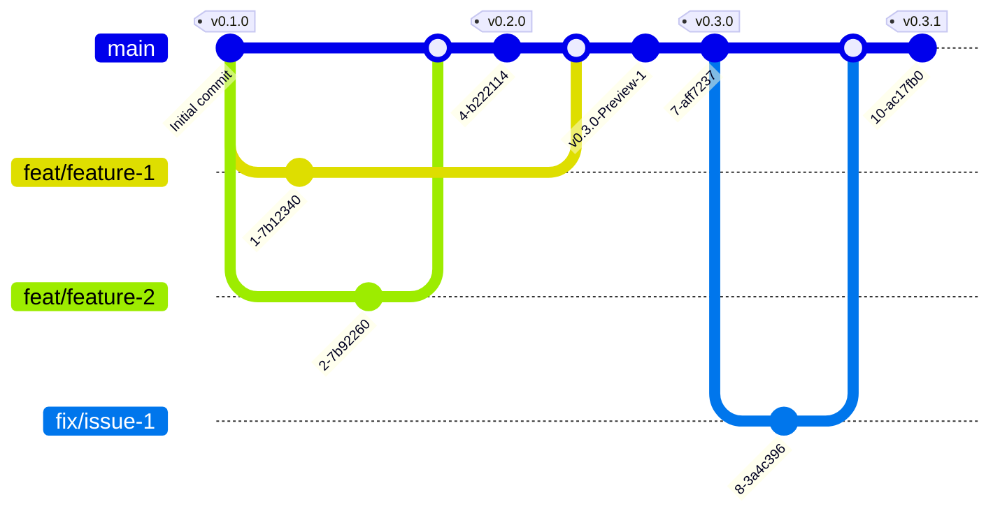

# Development Workflow

We use [GitHub Flow](https://docs.github.com/en/get-started/using-github/github-flow) for all code changes. All development happens through pull requests.

## Branching Strategy

- **main**: Stable, production-ready code.
- **feat/**: New features.
- **fix/**: Bug fixes.
- **docs/**: Documentation updates.

## Pull Requests

- All changes must go through a pull request.
- Ensure your branch is up to date with `main` before opening a PR.
- Reference related issues in your PR description.
- Use clear, descriptive titles and summaries.
- Request reviews from relevant team members.
- Address review comments promptly.
- Squash and rebase as needed before merging.
