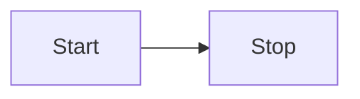

# Documentation

## Structure
- Documentation is written in Markdown and lives in the `docs/` folder.
- Use [VitePress](https://vitepress.dev/) for the documentation site.
- Organize docs by audience: user, developer, public.

## Writing Docs
- Use clear, concise language.
- Add code examples and diagrams where helpful.
- Keep documentation up to date with code changes.

## Diagrams with Mermaid
- Use [Mermaid](https://mermaid.js.org/) for diagrams.
- Example:

## Building & Previewing Docs
- `npm run docs:dev` – Start local dev server
- `npm run docs:build` – Build for production
- `npm run docs:preview` – Preview built docs
